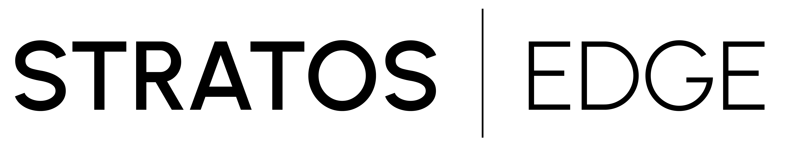
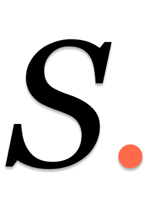

# Brand Guide

Visual identity for Stratos Edge — colors, typography, marks, and the signature devices that make a document instantly recognizable.

For the polished, shareable version with rendered swatches and type specimens, see [Stratos_Edge_Brand_Guide.pdf](./Stratos_Edge_Brand_Guide.pdf).

For voice and document profiles, see [Document-Guide.md](./Document-Guide.md).

> **Source of truth:** the live homepage at [stratosedge.ai](https://stratosedge.ai) and the FlightPlan deliverables. If anything here conflicts with what the homepage actually does, the homepage wins — this guide is updated to match.

---

## Color

The whole brand sits on a small palette. Use only these.

### Core

| Role | Hex | Where it lives |
|---|---|---|
| **INK** | `#04242D` | Deep teal-black. Headlines, body text, dark backgrounds, footer, wordmark on light. Replaces the older `#0E0E11`. |
| **CORAL** | `#FF6B4A` | The accent. Periods at the ends of headlines, CTA buttons, eyebrows, single-element emphasis. |
| **WHITE** | `#FFFFFF` | Default page background. |
| **OFFWHITE** | `#F8F8F8` | Alternating section background, card surfaces. |
| **CREAM** | `#F2F0E9` | Warm editorial sections, document body backgrounds. |

### Secondary / utility

| Role | Value | Use |
|---|---|---|
| Muted text | `rgba(4, 36, 45, 0.55)` | Sub-copy, captions, footers on light. Opacity-derived from INK — not a separate grey. |
| Hairline | `rgba(4, 36, 45, 0.08)` | Card borders, section dividers, accordion separators. |
| Coral gradient | `linear-gradient(135deg, #FF6B4A 0%, #FF8A6B 100%)` | CTA buttons only. Never headlines, never large fills. |
| Coral tint | `#FFF8F5` | Faint warm background for highlighted callouts. |
| Status — live | `#0F9D6E` | "Live / Confidential" dot. |
| Status — preview | `#E6A61C` | "Admin preview / Draft" dot. |

### Hierarchy on dark teal

When working on `#04242D`:

| Layer | Value |
|---|---|
| Primary text | `#FFFFFF` or `#F5F5F7` |
| Body / secondary | `rgba(245, 245, 247, 0.65)` |
| Muted | `rgba(245, 245, 247, 0.45)` |
| Footer | `rgba(245, 245, 247, 0.25)` |
| Accent | CORAL (renders correctly on the deep teal) |

Hierarchy on dark is opacity-driven, same principle as light pages. Don't introduce new greys.

### Do not use

- The old `#0E0E11` "near-black" — replaced by INK `#04242D`.
- Separate `#555` / `#999` greys for text. Use opacity on INK instead.
- A blue. Stratos Edge is teal + coral, not teal + blue.
- More than one coral per visible area. Coral is precious — one mark per moment.

---

## Typography

Two fonts, both Google Fonts.

### Work Sans — the brand voice

Used for every headline, every section title, every label, every UI element, every nav item, every wordmark, and the signature coral period device. Weights 100–600; brand voice lives at **400** for hero headlines and **200** for serene / large treatments (cover titles, FlightPlan auth gate).

Fallback: `-apple-system, BlinkMacSystemFont, 'Segoe UI', sans-serif`

### Lora — the body and the editorial moment

Used for body paragraphs, long-read content, and FlightPlan deliverable hero titles where editorial weight matters. Weights 400–700 plus italic.

Fallback: `Georgia, 'Times New Roman', serif`

### Pairing rule

- Structure (headlines, labels, UI, buttons, data) → **Work Sans**
- Story (body paragraphs, narrative, FlightPlan hero titles) → **Lora**
- The site's one notable inversion: **website nav is Lora**, not Work Sans — reads "publication," not "tech product."
- Differentiation comes through weight and italic style, not new colors.

### Type scale

| Element | Font | Size | Weight | Notes |
|---|---|---|---|---|
| Hero headline | Work Sans | 40–72pt | 400 | `-0.015em` to `-0.02em`. Coral period. |
| Section headline | Work Sans | 32–56pt | 400 | `-0.02em`. Coral period. |
| Cover title | Work Sans | 48–72pt | 200 | `-0.03em`. Coral period. |
| Sub-heading | Work Sans | 16–22pt | 600 | |
| Editorial hero | Lora | 32–48pt | 400 | FlightPlan / Playbook dark hero sections. |
| Body | Lora | 16–18pt | 400 | Line-height 1.55. INK. |
| Body small / caption | Lora | 13–14pt | 400 | MUTED. |
| Eyebrow / label | Work Sans | 9–13pt | 500–600 | UPPERCASE. `0.12–0.22em`. CORAL. |
| Wordmark small | Work Sans | 9–10pt | 500 | UPPERCASE. `0.25em`. |
| Button label | Work Sans | 14pt | 400 | |

---

## The coral period

The single most signature typographic move. Every brand headline ends with a coral period.

> What we help you do<span style="color:#FF6B4A">.</span>
> FlightPlan™ is how we do it<span style="color:#FF6B4A">.</span>
> Your documents are on the way<span style="color:#FF6B4A">.</span>
> Ready to see the full picture<span style="color:#FF6B4A">?</span>

**Mechanics.** The headline is set in INK / white / on-background color; only the terminal `.` switches to CORAL. The period inherits the headline's font weight and size — it just changes color.

```html
What we help you do<span style="color: #FF6B4A">.</span>
```

**Rules:**
- One per headline. Not per sentence in a paragraph.
- Always at the end. Never mid-headline.
- Question marks and exclamation marks follow the same rule — the terminal punctuation switches color.
- The period inherits the headline's font weight and size automatically — don't restyle it.
- Don't use on body paragraphs. The coral period is a *headline* device.
- Don't use more than once per visible page section. It loses meaning if repeated.

---

## Marks

### Wordmark — `STRATOS | EDGE`

Two colorways for the two backgrounds.

| | Asset |
|---|---|
| On light backgrounds (default) |  |
| On dark backgrounds |  |

**Construction.** Work Sans. `STRATOS` at weight 500, letter-spacing `0.18em`. Vertical pipe separator. `EDGE` at weight 300, letter-spacing `0.14em`, opacity 85%. Separator is `1px × 13px` at 25% (on dark) or 15% (on light) opacity.

**Clear space.** Equal to the cap height of the letterforms on all sides. Never crop into that space.

**Don't:** distort proportions, recolor, add drop-shadows, replace fonts, embed in colored circles, or use the wordmark and the lettermark together in the same composition.

### Lettermark

Compact mark for tight contexts where the full wordmark won't fit (favicons, app icons, profile photos, watermarks). Carries the signature coral period device.

| | Asset |
|---|---|
| On light |  |
| On dark |  |

---

## Signature devices

### Accent bar

Short coral gradient bar — section divider, or underline beneath a document title.

```
44pt wide · 3pt tall · 2pt radius · linear-gradient(135deg, #FF6B4A 0%, #FF8A6B 100%)
```

### Eyebrow label

Small uppercase tracked-out coral label sitting above a headline. One per section.

```
Work Sans · 9–13pt · weight 500–600 · UPPERCASE · letter-spacing 0.12–0.22em · CORAL
```

### Status dot

Small filled circle (6×6px) paired with a small Work Sans uppercase label. Used in document headers to indicate state.

- Live / confidential: `#0F9D6E`
- Admin preview / draft: `#E6A61C`
- Muted: `rgba(4, 36, 45, 0.3)`

---

## Backgrounds and section rhythm

| Background | Hex | Used for |
|---|---|---|
| WHITE | `#FFFFFF` | Default page background. Hero. |
| OFFWHITE | `#F8F8F8` | Alternating sections for rhythm. Stat blocks. |
| CREAM | `#F2F0E9` | Warm editorial moments. Long-read content. |
| DARK TEAL | `#04242D` | Hero bands, footers, FlightPlan section dividers, intentional drama. Always with white / coral text. |

A document that rotates `WHITE → OFFWHITE → DARK TEAL → WHITE` feels Stratos without any other styling work. Don't add a fifth background.

---

## Components and patterns

| Component | One-line | Specs |
|---|---|---|
| **Pull quote** | Short bold statement that interrupts body flow | 4pt CORAL left border · CREAM or OFFWHITE bg · Lora 400 italic ~12pt · 28pt vertical margin |
| **Emphasis line** | Two-line statement where the second carries the punch | Work Sans 300 throughout · punch phrase in CORAL at weight 500 · 26pt vertical margin |
| **Stat strip** | Row of 2–4 large numbers anchoring an argument | Numbers: Work Sans 200 · CORAL · Labels: Work Sans 500 · 7pt UPPERCASE · 0.08em · MUTED |
| **Numbered insight** | Numbered argument with big low-opacity number mark | Number: Work Sans 700 · CORAL at 25–30% opacity · Title: Work Sans 600 |
| **CTA button** | Action button | Coral gradient bg (135°) · Work Sans 9–10pt / 500 · white text · 6pt radius · one per page max |
| **Accent bar** | Coral gradient divider | 44pt × 3pt · 2pt radius · `linear-gradient(135deg, #FF6B4A, #FF8A6B)` |

---

## CSS variables (wired up in the website)

```css
--font-headline: 'Work Sans', -apple-system, BlinkMacSystemFont, 'Segoe UI', sans-serif;
--font-body: 'Lora', 'Georgia', 'Times New Roman', serif;
```

In TSX, the convention is to declare palette as local constants per page or component:

```tsx
const INK = '#04242D';
const MUTED = 'rgba(4, 36, 45, 0.55)';
const CORAL = '#FF6B4A';
const DARK_TEAL = '#04242D';
const CREAM = '#F2F0E9';
const OFFWHITE = '#F8F8F8';
```

Use these names. Don't redefine the palette under different variable names.

---

## What this guide is not

This is **visual identity only**. For document profiles (Stratos Simple vs Stratos Playbook) and how to format actual documents, see [Document-Guide.md](./Document-Guide.md).
